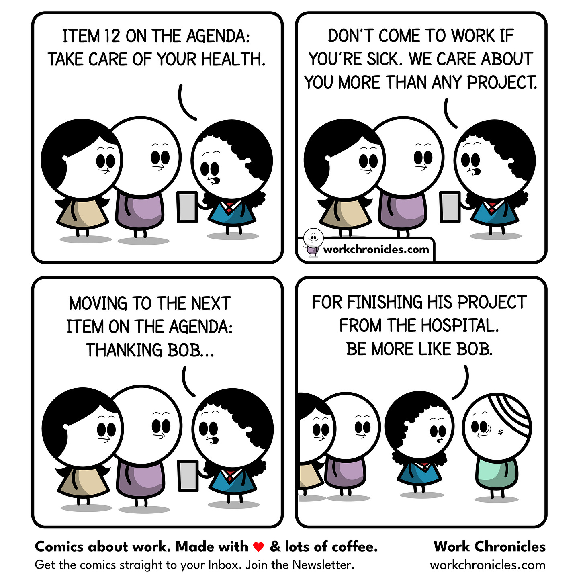

# Jeferson Franco - Full Stack Engineer & AI Enthusiast

👋 Hi! I'm Jeferson, a Full Stack Engineer with a passion for building high-performance, scalable web applications and
leveraging AI/ML to deliver innovative solutions. I specialize in Python and JavaScript ecosystems, with a strong
background in data engineering and cloud technologies.

## About Me

I'm a highly motivated professional with over 5 years of proven expertise in designing, developing, and deploying robust
web applications. My journey has taken me through various industries, from financial services to SaaS development, where
I've honed my skills in full-stack solutions, data processing, and AI integration.

I believe in the power of technology to solve real-world problems and am committed to continuous learning and staying at
the forefront of emerging trends in web development and artificial intelligence.

## Skills Matrix

### Frontend

| Skill      | Level    | Frameworks                  |
| ---------- | -------- | --------------------------- |
| JavaScript | Advanced | React.js, Next.js, Vue.js   |
| TypeScript | Advanced | React, Node.js              |
| CSS        | Advanced | Tailwind CSS, Bootstrap     |
| HTML5      | Advanced | Semantic, Accessibility     |
| State Mgmt | Advanced | Redux, Zustand, React Query |
| Testing    | Advanced | Jest, Playwright, Cypress   |

### Backend

| Skill          | Level    | Frameworks                  |
| -------------- | -------- | --------------------------- |
| Python         | Advanced | FastAPI, Flask, Django REST |
| Node.js        | Advanced | Express, NestJS             |
| APIs           | Advanced | REST, GraphQL, WebSocket    |
| Async          | Advanced | Asyncio, Celery             |
| Authentication | Advanced | OAuth, JWT, Firebase        |

### Data & AI/ML

| Skill            | Level    | Technologies                 |
| ---------------- | -------- | ---------------------------- |
| Data Engineering | Advanced | Apache Airflow, Prefect, ETL |
| Machine Learning | Advanced | PyTorch, Keras, Scikit-learn |
| NLP              | Advanced | BERT, Llama, Claude, ChatGPT |
| Data Processing  | Advanced | Pandas, PySpark, Dask        |
| Vector DB        | Advanced | Chroma, FAISS, Pinecone      |

### DevOps & Cloud

| Skill                  | Level        | Platforms                  |
| ---------------------- | ------------ | -------------------------- |
| Docker                 | Advanced     | Containerization, Compose  |
| Kubernetes             | Intermediate | Orchestration, Helm        |
| CI/CD                  | Advanced     | GitHub Actions, Jenkins    |
| Cloud                  | Advanced     | AWS (S3, EC2, Lambda), GCP |
| Infrastructure as Code | Advanced     | AWS CDK, Terraform         |

## Professional Experience

### Full Stack Engineer (Freelance)

_Feb 2025 - Present_

- Architected and developed full-stack solutions for NDA clients using React.js, Next.js, and Node.js
- Implemented Retrieval-Augmented Generation (RAG) systems integrated with LLMs for customer support optimization
- Designed robust RESTful and GraphQL APIs using FastAPI and Flask with JWT authentication
- **Project Alpha**: Built FastAPI microservices handling >5,000 requests/min with PostgreSQL and Docker, achieving
  99.9% uptime
- Created automated ETL pipelines using Python and Apache Airflow for AWS infrastructure

### Full Stack Developer & Data Engineer @ Mtrix

_Apr 2023 - Feb 2025_

- Developed interactive data visualization dashboards for major brands (Nivea, Pepsico, Reckitt)
- Led performance optimization efforts, reducing image sizes and optimizing queries
- Contributed to a global component library with micro-frontend architecture
- Authored Python ETL scripts orchestrating large datasets (50GB+ daily) for data warehousing

### Full Stack Developer & Functional Analyst @ KTGroup

_Mar 2022 - Apr 2023_

- Designed and deployed web applications using Node.js and MongoDB
- Architected backend services in Flask and FastAPI for international clients
- Created Flask-based document processing API with OCR and LLM summarization
- Participated in architectural decisions contributing to multi-million contract renewal

## Featured Projects

### **AI-Powered Document Processing System**

- Developed a Flask-based API integrating OCR and LLM-based summarization with Celery + Redis
- Implemented asynchronous task queues for processing documents
- Deployed production-ready API with monitoring and maintenance capabilities

### **Real-Time Analytics Dashboard**

- Built interactive data visualization dashboards using React.js, TypeScript, and PostgreSQL
- Implemented performance optimizations including memoization and code splitting
- Improved strategic insights by 20% through enhanced data presentation

### **Microservices Architecture with FastAPI**

- Created a system of FastAPI microservices handling 5,000+ requests per minute
- Implemented containerized services with Docker and PostgreSQL via SQLAlchemy
- Achieved 99.9% uptime through proper error handling and monitoring

## TELOS Framework

### Problems

- **P1:** Unemployment in software development for older, undereducated individuals
- **P2:** Lack of awareness and control over digital footprint and privacy
- **P3:** The dangerous blend of "dumb", "confident", and "proud" in human behavior

### Missions

- **M1:** Empower the next generation with valuable knowledge to prevent unemployment and foster economic independence
- **M2:** Model and advocate for conscious digital exposure to protect personal freedom in a hyperconnected world
- **M3:** Mentor self-awareness and humility through interdisciplinary practices like jiu-jitsu

### Goals

- **G1:** Complete a full-stack web development portfolio by December 2025
- **G2:** Complete a privacy audit of all personal devices quarterly
- **G3:** Develop a personal curriculum linking jiu-jitsu principles with emotional intelligence by October 2025

## Open Source & Community

- Active contributor to various open-source projects
- Advocate for clean code, testing, and documentation
- Participate in technical meetups and knowledge sharing events
- Mentor junior developers on best practices in API design and performance tuning

## Education

- **Bachelor's Degree in International Business, Trade, and Tax Law** - Paulista University (UNIP)
- Relevant coursework: Business Analytics, Process Management, International Trade

## Languages

- 🇧🇷 Portuguese: Native
- 🇺🇸 English: Advanced (C1)
- 🇪🇸 Spanish: Professional Proficiency

## Contact

---

"Empowering minds, guarding freedom, and mentoring humility for a more conscious generation."

## Latest Work Chronicles Comic

